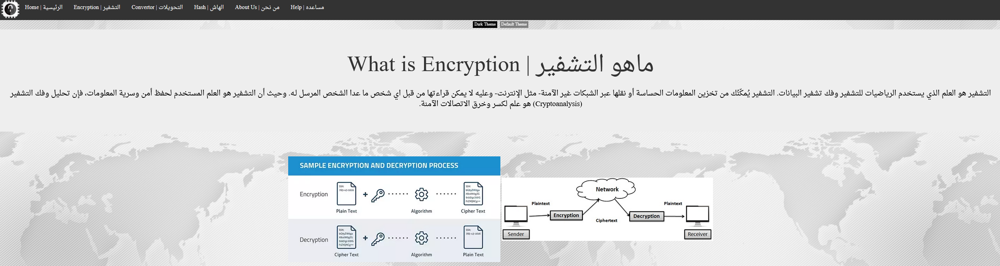
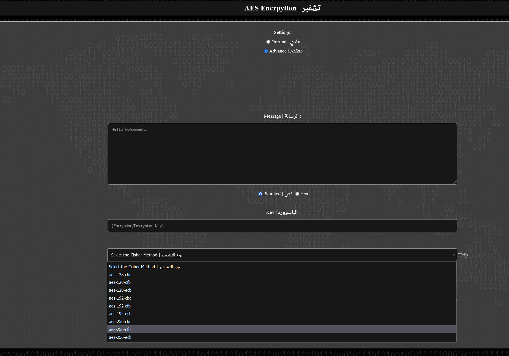
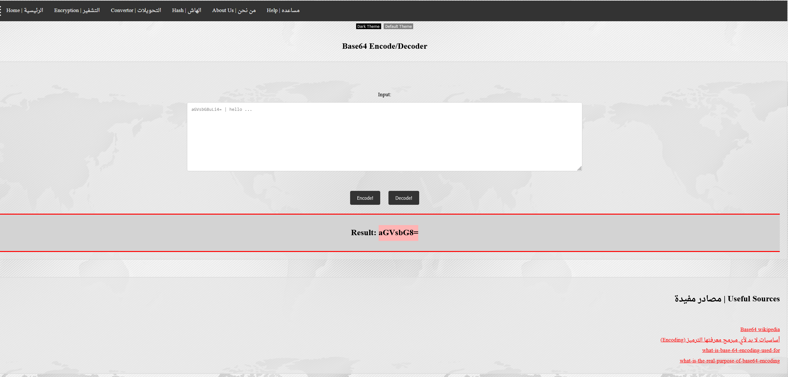
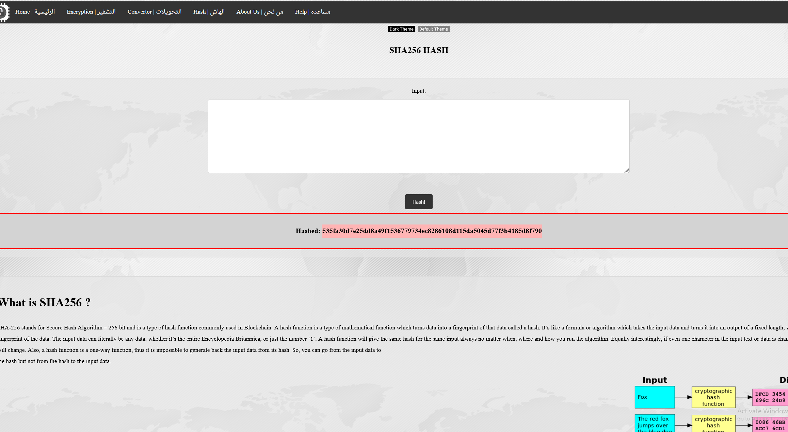

# What is this? 

A simple web-application for educating users about encryption and hash algorithms in the Arabic language. I developed this project to apply for the national computer olympiad in 2018 in Saudi Arabia.
I won the second-best project in Riyadh. 

# Usage
Download all project files and deploy your local host (Xampp). 
*Tested on PHP Version 7.3.12
